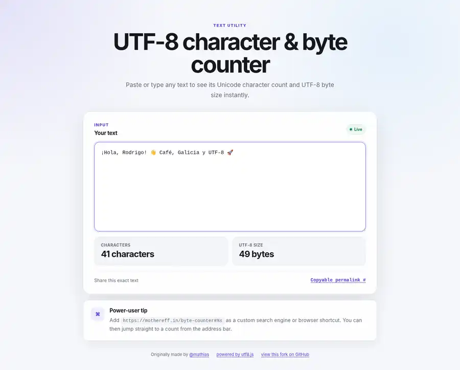
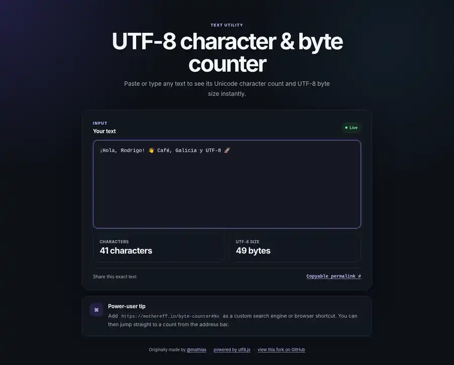

# [String length and UTF-8 byte counter](https://mothereff.in/byte-counter)

Made by [Mathias Bynens](https://mathiasbynens.be/).

## Modern interface preview

The screenshots below show the redesigned responsive interface using the test string:

`¡Hola, Rodrigo! 👋 Café, Galicia y UTF-8 🚀`

Result: **41 characters** and **49 UTF-8 bytes**.

### Desktop — light mode

### Desktop — dark mode

### Mobile — light mode

